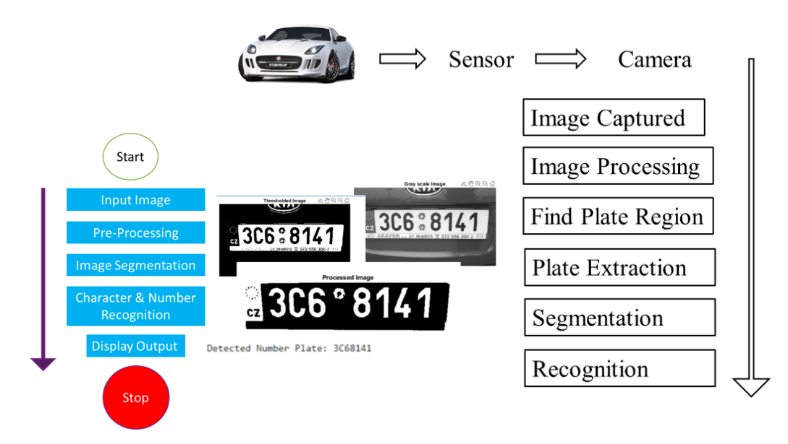

# Advanced_sensor_course_CVUT
B222-E141030 - Sensor systems - lab sessions for students - spring 22/23

Lab1:
Algorithms 
•	Sending and reading data with MQTT.
•	Online calculation of average and variance.
•	Confidence-Weighted Averaging from more than 2 sensors.
•	Voting from more sensor data: Exact majority voter , Formalized majority voter, Weighted average voter.
•	Amplitude and time thresholding.
•	Complementary filter (orientation measurement on drone frame)

Lab4:
This lab concerns the problem of applying a Kalman filter to a variety of measurements.
The measurements are numerical data that has been recorded over time in order to
Provide samples to filter. There are two measurement sets, one that was recorded in one
Dimension and another recorded in two dimensions. In practice the Kalman filter would be
Used actively to filter the measurements in real time.

Lab5:
Image processing lab contains:
  1- Image Processing - Display and Simple Manipulation, CV classifiers.
  2-  Vehicle Number Plate Recognition System.
  3- Multiple Face Detection System using webcam live.
  4- Car Detection.
  
  
  
  
  
  

